# @blen/clinicaltrial-mcp-server

**Code-mode MCP server for ClinicalTrials.gov.**
Exposes the v2 REST API as a typed TypeScript SDK that the model calls from
inside a secure sandbox, following Cloudflare's
["code mode"](https://blog.cloudflare.com/code-mode/) pattern.

> *Display name in the Claude directory:* **ClinicalTrials.gov Explorer (by BLEN)**.
> Unaffiliated with NIH / NLM / ClinicalTrials.gov. Data retrieved live from
> <https://clinicaltrials.gov/api/v2>.

---

## Table of contents

- [What "code mode" means here](#what-code-mode-means-here)
- [Quickstart — use it with Claude Desktop (npx)](#quickstart--use-it-with-claude-desktop-npx)
- [Build an MCPB desktop extension](#build-an-mcpb-desktop-extension)
- [Local development](#local-development)
  - [Prerequisites](#prerequisites)
  - [Troubleshooting: `No sandbox executor available`](#troubleshooting-no-sandbox-executor-available)
  - [Setup](#setup)
  - [Running the server locally](#running-the-server-locally)
  - [Point Claude Desktop at your dev checkout (stdio)](#point-claude-desktop-at-your-dev-checkout-stdio)
  - [Useful scripts](#useful-scripts)
- [Architecture at a glance](#architecture-at-a-glance)
- [MCP tools](#mcp-tools)
- [Configuration reference](#configuration-reference)
- [Sandbox](#sandbox)
- [Remote (hosted) mode](#remote-hosted-mode)
- [AWS deploy](#aws-deploy)
- [Directory submission](#directory-submission)
- [Testing](#testing)
  - [Behavior when no sandbox is installed](#behavior-when-no-sandbox-is-installed)
- [Data handling](#data-handling)
- [Contributing, support, license](#contributing-support-license)

---

## What "code mode" means here

Rather than exposing each API operation as a separate MCP tool (the usual
pattern, which quickly blows up the LLM's context), this server ships three
tools:

| Tool | Purpose |
|---|---|
| `search_api` | BM25 search over endpoints + study-field docs. Returns a TypeScript snippet the model should paste. |
| `describe_schema` | Look up study-field docs by exact `path` or `prefix`. |
| `execute` | Run a short async TypeScript body against a typed `ctgov` SDK in a sandboxed V8 isolate (or Deno fallback). |

The full ClinicalTrials.gov surface fits in a few hundred tokens this way. The
model writes one function, chains calls, filters locally, and returns results.

---

## Quickstart — use it with Claude Desktop (npx)

**Prerequisites**

- **Node.js 20.10+** (`22.x` recommended when you want the smoothest
  `isolated-vm` experience)
- **One sandbox runtime** — the `execute` tool needs somewhere to run
  untrusted code. You need **either**:
  - `isolated-vm` (installed automatically by `pnpm install` / `npm install`
    when prebuilt binaries exist for your platform, or when a C toolchain +
    Python 3 are available for a native build), **or**
  - the [Deno](https://deno.com) CLI on `PATH` as a fallback
    (`brew install deno` on macOS,
    `curl -fsSL https://deno.land/install.sh | sh` on Linux/WSL).

If neither is present, the server will start but refuse `execute` calls with
`No sandbox executor available`. See
[Troubleshooting](#troubleshooting-no-sandbox-executor-available) for the
fix.

```bash
# One-time sanity check
npx -y @blen/clinicaltrial-mcp-server --version
```

Add to your Claude Desktop config
(macOS: `~/Library/Application Support/Claude/claude_desktop_config.json`,
Windows: `%APPDATA%\Claude\claude_desktop_config.json`):

```json
{
  "mcpServers": {
    "ctgov": {
      "command": "npx",
      "args": ["-y", "@blen/clinicaltrial-mcp-server"]
    }
  }
}
```

Restart Claude Desktop; the tools appear under the ClinicalTrials.gov Explorer
entry.

---

## Build an MCPB desktop extension

This repo can now generate a Claude Desktop extension bundle (`.mcpb`) using
Anthropic's MCPB workflow. The default bundle is **cross-platform for Claude
Desktop on macOS and Windows**: it embeds the Deno helpers needed by the
`execute` sandbox so end users do not have to install Deno themselves.

Build the extension:

```bash
pnpm install
pnpm mcpb:pack
```

That usually produces:

```text
.mcpb/dist/clinicaltrial-mcp-server-<version>.mcpb
```

Useful commands:

```bash
pnpm mcpb:prepare   # stage a clean production bundle under .mcpb/stage
pnpm mcpb:validate  # validate the generated manifest with the official CLI
pnpm mcpb:pack      # validate + pack the final .mcpb archive
```

Notes:

- The pack step requires a local Deno binary on the build machine. The script
  copies the host binary into the extension bundle, downloads matching helpers
  for the other bundled targets, and points `CTGOV_DENO_ROOT` at the packaged
  helper directory.
- The default target set is `darwin-arm64`, `darwin-x64`, and `win32-x64`, so
  the same `.mcpb` works in Claude Desktop on macOS and Windows.
- To narrow or customize the bundle, set `CTGOV_MCPB_TARGETS`, for example:
  `CTGOV_MCPB_TARGETS=darwin-arm64,win32-x64 pnpm mcpb:pack`.
- Installation in Claude Desktop follows Anthropic's MCPB flow:
  double-click the file, drag it into Claude Desktop, or use
  `Developer -> Extensions -> Install Extension`.

---

## Local development

Clone the repo, install, run tests, and point Claude at your local checkout.

### Prerequisites

- Node.js **20.10+** (`22.x` recommended for native `isolated-vm`)
- pnpm **10.33+** (`corepack enable && corepack prepare pnpm@10.33.0 --activate`)
- **A sandbox runtime** — at least one of:
  - `isolated-vm` (default, fastest). Native addon; installs via `pnpm install`.
    Prebuilt binaries cover common platforms; when they don't, a C toolchain +
    Python 3 is required (`build-essential` on Debian/Ubuntu;
    `xcode-select --install` on macOS).
  - [Deno](https://deno.com) — the subprocess fallback. Install with
    `brew install deno` / `curl -fsSL https://deno.land/install.sh | sh`.
- (Optional) Docker + BuildKit for the container build
- (Optional) Terraform ≥ 1.7 and AWS CLI v2 for the AWS deploy module

#### Troubleshooting: `No sandbox executor available`

If `pnpm test` prints
`CtGovError: No sandbox executor available. Install isolated-vm (...) or the Deno CLI (...)`,
your machine has neither sandbox configured. Pick **one**:

**Easiest — install Deno** (works on every platform, no toolchain needed):

```bash
# macOS
brew install deno
# Linux / WSL
curl -fsSL https://deno.land/install.sh | sh
```

Then re-run `pnpm test`. The sandbox-requiring tests will pick up Deno
automatically; you'll see them pass instead of skip.

**Alternative — make `isolated-vm` build locally**:

```bash
# macOS (Apple Silicon or Intel)
xcode-select --install            # installs clang + headers
# pnpm's prebuild fallback will invoke node-gyp against system Python 3

# Debian / Ubuntu
sudo apt-get install -y build-essential python3

# Then rebuild just this native dep:
pnpm rebuild isolated-vm
node -e 'require("isolated-vm"); console.log("ok")'
```

If `pnpm install` finished with
`Ignored build scripts: isolated-vm` — pnpm's approve-builds policy blocked
the native compile. This repo ships `pnpm-workspace.yaml` with
`onlyBuiltDependencies: [isolated-vm]` which should allow it; if it still
complains, run `pnpm approve-builds` once and re-run `pnpm install`.

Sandbox-requiring test suites (`sandbox.spec.ts`, `sandboxChaos.spec.ts`,
`httpServer.spec.ts`, `authHttp.spec.ts`, `embeddedEndToEnd.spec.ts`) **skip
gracefully** when neither sandbox is available so the rest of the suite
stays green.

### Setup

```bash
git clone https://github.com/blencorp/claude-playground.git
cd claude-playground
cp .env.example .env               # edit values; see Configuration reference
pnpm install                        # builds isolated-vm via node-gyp
pnpm typecheck                      # strict TS pass
pnpm lint                           # eslint
pnpm test                           # ~60 tests, < 10s
pnpm build                          # emits dist/
```

### Running the server locally

Four modes:

```bash
# stdio transport (default) — what Claude Desktop uses over npx
pnpm dev                            # tsx, hot source from src/
# or after `pnpm build`:
node dist/bin.js

# HTTP transport against the built-in embedded OAuth server (self-host)
# Populate CTGOV_AUTH_PROVIDER=embedded, CTGOV_EMBEDDED_USERS etc. in .env
export $(grep -v '^#' .env | xargs)   # or use `direnv`, `dotenv-cli`, etc.
node dist/bin.js --http --port 8080

# HTTP transport with no auth (DEV ONLY — do not expose publicly)
node dist/bin.js --http --port 8080 --insecure

# Force a specific sandbox
node dist/bin.js --sandbox isolate    # or: deno | auto
```

### Point Claude Desktop at your dev checkout (stdio)

```json
{
  "mcpServers": {
    "ctgov-dev": {
      "command": "node",
      "args": ["/absolute/path/to/claude-playground/dist/bin.js"],
      "env": {
        "CTGOV_LOG_LEVEL": "debug"
      }
    }
  }
}
```

Use `"command": "npx"` with `"args": ["tsx", "src/bin.ts"]` if you prefer
hot-reloading from source.

### Useful scripts

```bash
pnpm dev                    # tsx src/bin.ts (stdio)
pnpm test:watch             # vitest watch mode
pnpm regen:sdk              # refresh pinned OpenAPI + field dictionary (needs network)
pnpm verify:schema          # CI-grade drift check
pnpm check:directory URL    # run the submission-directory checklist against a live URL
pnpm build                  # tsc → dist/
pnpm start                  # node dist/bin.js (stdio)
```

---

## Architecture at a glance

```mermaid
flowchart TD
    Transport["Transport<br/>stdio &#124; Streamable HTTP + OAuth"]
    Server["buildMcpServer<br/>tools: search_api, describe_schema, execute"]
    Supervisor["SubjectQuota (per-sub + global 10 rps)<br/>HttpClient: undici, LRU, retry, zod, audit, stale-cache"]
    Sandbox["Sandbox (isolated-vm &#124; deno)<br/>AST allow-list (acorn)<br/>ctgov.* SDK via RPC only"]
    CTGov[("ClinicalTrials.gov v2")]

    Transport --> Server
    Server --> Supervisor
    Supervisor --> Sandbox
    Supervisor --> CTGov
```



Details in [`docs/ARCHITECTURE.md`](./docs/ARCHITECTURE.md).

---

## MCP tools

### `search_api(query, k?)`

Semantic BM25 search over the 9 API endpoints and the curated study-field
dictionary. Returns a TypeScript snippet the model should paste plus a short
summary of hit counts.

### `describe_schema(path? | prefix?)`

Lookup for study-data fields by exact dotted `path` (e.g.
`protocolSection.eligibilityModule.eligibilityCriteria`) or by `prefix`
(e.g. `protocolSection.designModule`).

### `execute(code, timeoutMs?, memoryMb?)`

Wraps the submitted body as `async (ctgov) => { <body> }` and runs it in the
sandbox. The return value is JSON-serialized and returned. The SDK surface
inside the sandbox:

```ts
ctgov.studies.search(params)        // GET /studies
ctgov.studies.searchAll(params, o?) // async iterator over pages
ctgov.studies.get(nctId, params?)   // GET /studies/{nctId}
ctgov.studies.metadata(params?)     // GET /studies/metadata
ctgov.studies.searchAreas()         // GET /studies/search-areas
ctgov.studies.enums()               // GET /studies/enums
ctgov.stats.size()                  // GET /stats/size
ctgov.stats.fieldValues({fields})   // GET /stats/field/values
ctgov.stats.fieldSizes({fields})    // GET /stats/field/sizes
ctgov.version()                     // GET /version
```

Five worked examples live in [`examples/`](./examples).

---

## Configuration reference

All configuration is via environment variables. Copy
[`.env.example`](./.env.example) to `.env` and edit.

### Transport / runtime

| Variable | Default | Description |
|---|---|---|
| `PORT` | `8080` | HTTP port (used with `--http`). |
| `HOST` | `0.0.0.0` | HTTP bind address. |
| `CTGOV_LOG_LEVEL` | `info` | `debug` / `info` / `warn` / `error`. |
| `CTGOV_SANDBOX` | `auto` | `isolate` / `deno` / `auto`. Equivalent to `--sandbox`. |
| `CTGOV_DENO_PATH` | *(PATH lookup)* | Explicit path to the `deno` binary for the fallback executor. |
| `CTGOV_DENO_ROOT` | *(none)* | Directory containing bundled Deno helpers laid out as `<platform>-<arch>/deno(.exe)`; mainly used by the packaged MCPB bundle. |

### Auth

| Variable | Default | Description |
|---|---|---|
| `CTGOV_AUTH_PROVIDER` | `none` | `clerk` / `workos` / `auth0` / `generic-oidc` / `embedded` / `none`. |
| `CTGOV_AUTH_ISSUER` | *(none)* | Authorization server URL. Required when provider ≠ `none`. |
| `CTGOV_AUTH_JWKS_URL` | *derived* | Defaults to `${issuer}/.well-known/jwks.json` (or `${issuer}/as/jwks.json` for `embedded`). |
| `CTGOV_AUTH_RESOURCE` | `https://clinicaltrial.mcp.blencorp.com/mcp` | RFC 8707 audience / our `resource` identifier. |
| `CTGOV_AUTH_SCOPES` | `ctgov.read` | Whitespace- or comma-separated list. |

### Embedded AS (self-host only)

| Variable | Description |
|---|---|
| `CTGOV_EMBEDDED_USERS` | `alice:pass1,bob:pass2` — HTTP Basic credentials resolved during `/as/authorize`. |

### Tests / scripts

| Variable | Description |
|---|---|
| `CTGOV_LIVE` | Set to `1` to enable `test/liveIntegration.spec.ts` (hits real CT.gov). |
| `CTGOV_BASE` | Override the upstream base URL for the `regen:sdk` and `verify:schema` scripts. |

---

## Sandbox

Auto-selects `isolated-vm` (V8 isolate, native addon) and falls back to a
`deno` subprocess with `--no-prompt --allow-none --no-npm --no-remote` when
the native addon isn't available. Both enforce identical policy:

- No network, no filesystem, no env, no FFI, no subprocess.
- AST preflight (acorn) rejects direct escape hatches like `import`,
  dynamic `import()`, `eval`, `new Function`, `process`, `__host`, and
  unsafe prototype access before execution. The runtime sandbox remains the
  primary security boundary.
- 15 s wall-clock, 64 MB heap (isolate mode); per-call overrides available
  via `timeoutMs` / `memoryMb`.
- Only capability: the `ctgov.*` binding proxied over host RPC.

Force a specific executor:

```bash
clinicaltrial-mcp-server --sandbox isolate    # require isolated-vm
clinicaltrial-mcp-server --sandbox deno       # require deno on PATH
clinicaltrial-mcp-server --sandbox auto       # default
```

---

## Remote (hosted) mode

Run the same server over the MCP Streamable HTTP transport with a real
OAuth Authorization Server in front.

### With Clerk (production default)

```bash
export CTGOV_AUTH_PROVIDER=clerk
export CTGOV_AUTH_ISSUER=https://clerk.blencorp.com
export CTGOV_AUTH_RESOURCE=https://clinicaltrial.mcp.blencorp.com/mcp
export CTGOV_AUTH_SCOPES=ctgov.read
node dist/bin.js --http --port 8080
```

Clerk (or WorkOS / Auth0 / any OIDC AS) must be configured with
[RFC 7591 Dynamic Client Registration](https://datatracker.ietf.org/doc/html/rfc7591)
so Claude can self-register, and the audience / resource set to
`https://clinicaltrial.mcp.blencorp.com/mcp` (RFC 8707).

### With the built-in embedded AS (self-host)

```bash
export CTGOV_AUTH_PROVIDER=embedded
export CTGOV_AUTH_ISSUER=https://your.host     # must match where this server is reachable
export CTGOV_AUTH_RESOURCE=https://your.host/mcp
export CTGOV_EMBEDDED_USERS=alice:wonderland
node dist/bin.js --http --port 8080
```

Endpoints exposed:

| Path | Purpose |
|---|---|
| `POST /mcp` | MCP Streamable HTTP (stateful per-session transport). |
| `GET /healthz`, `/readyz` | ALB health checks. |
| `GET /.well-known/oauth-protected-resource` | RFC 9728 PRM. |
| `GET /.well-known/oauth-authorization-server` | RFC 8414 AS metadata (proxied from issuer, or served directly by the embedded AS). |
| `POST /as/register` | (embedded) RFC 7591 DCR. |
| `GET  /as/authorize` | (embedded) OAuth 2.1 + PKCE S256. |
| `POST /as/token` | (embedded) authorization_code / refresh_token grants. |
| `GET  /as/jwks.json` | (embedded) public JWKS. |

A missing/invalid bearer returns `401` with
`WWW-Authenticate: Bearer realm="…", resource_metadata="…"` pointing at the PRM.

---

## AWS deploy

Terraform module at [`deploy/aws/`](./deploy/aws/README.md) stands up:

**ECS Fargate + ALB + ACM + Route 53 + Secrets Manager + CloudWatch Logs + WAFv2**

on `clinicaltrial.mcp.blencorp.com`, with a GitHub Actions OIDC deployer role.
The container is built from [`deploy/Dockerfile`](./deploy/Dockerfile)
(multi-stage, non-root, tini, isolated-vm compiled in).

```bash
cd deploy/aws
cp terraform.tfvars.example terraform.tfvars   # edit clerk_issuer, CIDRs, etc.
terraform init
terraform apply

# Build & push first image
ACCOUNT=$(aws sts get-caller-identity --query Account --output text)
ECR=$(terraform output -raw ecr_repository_url)
aws ecr get-login-password --region us-east-1 | \
  docker login --username AWS --password-stdin "$ACCOUNT.dkr.ecr.us-east-1.amazonaws.com"
docker buildx build --platform linux/amd64 -t "$ECR:v0.1.0-alpha.0" -f deploy/Dockerfile . --push
aws ecs update-service --cluster clinicaltrial-mcp-server --service clinicaltrial-mcp-server --force-new-deployment
```

Subsequent deploys happen automatically from
[`.github/workflows/deploy.yml`](./.github/workflows/deploy.yml) on pushes to
`main`.

---

## Directory submission

`pnpm check:directory https://clinicaltrial.mcp.blencorp.com` runs the full
submission-readiness checklist (HTTPS, PRM, AS metadata, 401 discovery hint,
examples, legal docs). Full reviewer-facing dossier in
[`legal/submission-packet.md`](./legal/submission-packet.md). Submit via
[claude.com/connectors](https://claude.com/connectors).

---

## Testing

```bash
pnpm test                           # unit + integration (nock, MockAgent)
CTGOV_LIVE=1 pnpm test              # also run the live CT.gov harness
pnpm test -- test/embeddedEndToEnd.spec.ts   # single suite
pnpm test:watch
```

CI (`.github/workflows/ci.yml`) runs lint, typecheck, tests, build, CLI
smoke-test, and a Docker image build on every PR. A weekly workflow
(`.github/workflows/schema-drift.yml`) re-runs `pnpm verify:schema` and
auto-files an issue when the pinned OpenAPI diverges from upstream.

### Behavior when no sandbox is installed

`pnpm test` inspects the host at startup and **skips sandbox-dependent
suites cleanly** rather than failing when neither `isolated-vm` nor
`deno` is available. Expected outcomes:

| Host state | Expected `pnpm test` result |
|---|---|
| Both `isolated-vm` and `deno` installed | **59 passed / 6 skipped** (live integration + remaining Deno-parity). |
| Only `isolated-vm` installed (CI, production) | **59 passed / 6 skipped**. |
| Only `deno` installed (portable dev machines) | **~48 passed / ~17 skipped** (isolate-only chaos tests skip). |
| Neither installed (fresh clone, no toolchain) | **42 passed / 23 skipped / 0 failed**. Install Deno or fix `isolated-vm` as in the [troubleshooting section](#troubleshooting-no-sandbox-executor-available) to make the rest pass. |

The following suites opt in to `describe.skipIf(!isAnySandboxAvailable())`:

- `test/sandbox.spec.ts`
- `test/sandboxChaos.spec.ts` — isolate chunk uses `isIsolateAvailable()`
- `test/httpServer.spec.ts`
- `test/authHttp.spec.ts`
- `test/embeddedEndToEnd.spec.ts`

A separate `test/liveIntegration.spec.ts` only runs under
`CTGOV_LIVE=1` and hits the real ClinicalTrials.gov API; it is unrelated
to the sandbox gating above.

---

## Data handling

- 5-minute in-memory response cache (per session, never persisted).
- 30-day structured audit logs (OAuth `sub`, trace id, upstream URL, status,
  duration, bytes). Used only for abuse response. No request bodies retained.
- No PII beyond the OAuth subject is collected.

Details: [`legal/privacy-policy.md`](./legal/privacy-policy.md).

---

## Contributing, support, license

- **Contributing**: see [CONTRIBUTING.md](./CONTRIBUTING.md).
- **Security disclosures**: see [SECURITY.md](./SECURITY.md) or email
  <opensource@blencorp.com> with subject `[security] clinicaltrial-mcp-server`.
- **Conduct**: [CODE_OF_CONDUCT.md](./CODE_OF_CONDUCT.md).
- **Support**: <opensource@blencorp.com>; SLOs in
  [`legal/support.md`](./legal/support.md).
- **License**: [MIT](./LICENSE).
